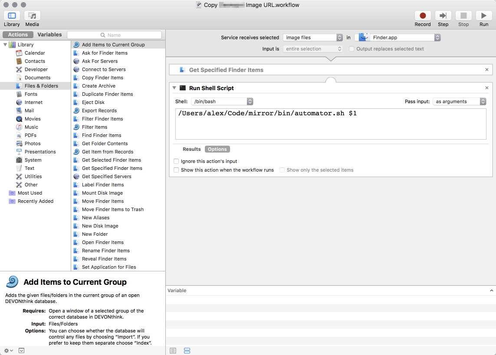
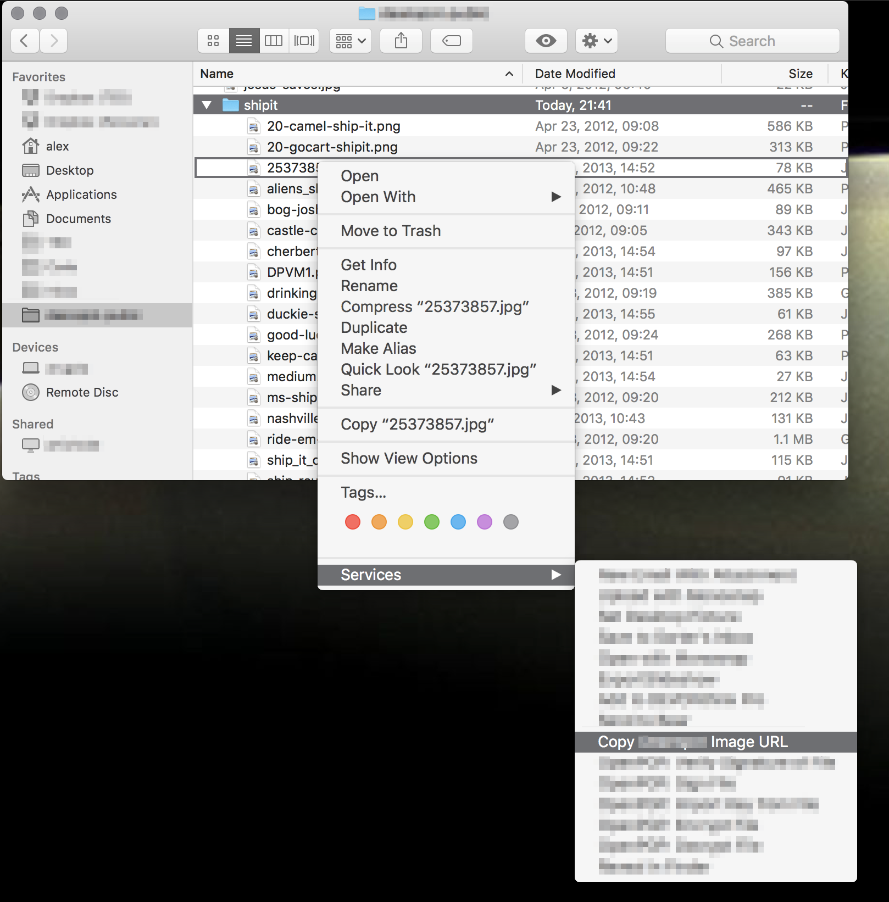

## Mirror

Mirror is two things:

  1. A background process to upload files from a local directory to a WebDAV
     server.
  2. An OSX Automator service to generate the proper remote URL for each
     file via a Finder action.

## Basic Usage

  1. Drop an image file into a local directory.
  2. Mirror uploads this file to your web server.
  3. Right-click on the image. Mirror provides a context menu to copy the URL
     to this image.
  4. Paste image URL into your chat room of choice.
  5. LOL.

## Setup

### Configure a WebDAV server

This is my nginx configuration, which utilizes the [ngx_http_dav_module](http://nginx.org/en/docs/http/ngx_http_dav_module.html).

```
location /dav/public/ {
  root /var/www/webdav;

  limit_except GET {
    auth_basic "webdav";
    auth_basic_user_file /var/www/webdav/users.htpasswd;
  }

  autoindex off;

  dav_methods PUT DELETE;
  dav_access group:rw all:r;

  client_max_body_size 0;
  client_body_temp_path /var/www/webdav/tmp;
  create_full_put_path  on;
}
```

Make sure to create the basic auth password file.

### Set up ruby

```
cd mirror
rvm install ruby-2.3.3
gem install bundler
bundle
```

### Add an Automator Service

I don't currently know of a convenient way to distribute Automator scripts,
but recreating this one should be pretty easy.



### Set up configuration file

```
cp config.example.yml config.yml
```

And now populate `config.yml` with valid values.

### Start background process

Lots of paths need to be adjusted in the .plist file.

Open an issue if you actually want me to make this simpler to set up. At this
point I'm assuming that I'm basically talking to myself in this document.

```
cp support/org.deanspot.mirror.plist ~/Library/LaunchAgents
launchctl load ~/Library/LaunchAgents/org.deanspot.mirror.plist
```

### Add some images to your local directory

Copy some image files into your local directory.
Watch the log file for activity.

### Notifications

If the `osascript` command is in your `$PATH`, an OSX notification will be displayed
whenever mirror uploads or deletes a file.

### Clipboard Integration

Whenever a file is uploaded, the remote path to that file will be copied to your
local clipboard.

### Use Finder to get URLs to the uploaded files

This Finder action will place a URL on your clipboard.



## Screenshot Uploading

mirror contains an additional script intended for easy management of screenshots.

The basic idea is a `launchd` service that watches your screenshot directory for
file names matching a pattern. Any files found get a random URL-safe name and
are moved to the mirror upload directory. The final URL is then copied to your
clipboard.

### Setup

First: modify `support/org.deanspot.screener.plist`.

  1. Set `WatchPaths` to the directory where OSX places screenshots. See
     [this blog post](https://www.howtoisolve.com/how-to-change-screenshot-default-saved-path-in-mac-os-x-mavericks-yosemite/)
     if you'd like to change this from its default (which is to place all screenshots
     on your desktop).
  2. Set the two directories in `ProgramArguments`.
    1. The first should be the same directory as that used for `WatchPaths`.
    2. The second should be a directory being watched by the main `mirror` process. (See above.)

Then do the following:

```
cp support/org.deanspot.screener.plist ~/Library/LaunchAgents
launchctl load ~/Library/LaunchAgents/org.deanspot.screener.plist
```

### Usage

  1. Take a screenshot.

Your screenshot will be renamed (to make a URL-friendly filename) and moved to the
configured (`mirror`-managed) directory. Once `mirror` uploads the file, a
notification will be displayed and the file's URL will be copied to your clipboard.
